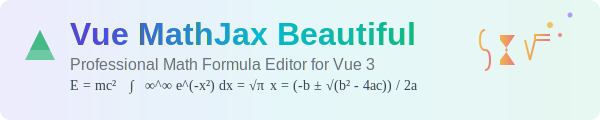

<div align="center">
  
</div>

<div align="center">

# Vue MathJax Beautiful

一个基于 Vue 3 和 MathJax 的强大数学公式编辑器组件库，提供专业的数学公式编辑功能。

</div>

- 📖 演示地址: [在线地址](https://zzq-github.github.io/vue-mathjax-beautiful)

## ✨ 特性

- 🧮 **专业公式编辑** - 基于 MathJax 引擎，支持完整的 LaTeX 语法
- 🎨 **丰富符号面板** - 240+ 数学符号和 38 个常用公式模板
- 👀 **实时预览** - 所见即所得的公式编辑体验

- 🚀 **Vue 3 + TypeScript** - 现代化的技术栈
- 📱 **响应式设计** - 完美适配桌面端和移动端
- 🔧 **易于集成** - 简单的 API 设计，轻松集成到现有项目

## 📦 安装

使用 npm：
```bash
npm install vue-mathjax-beautiful
```

使用 yarn：
```bash
yarn add vue-mathjax-beautiful
```

使用 pnpm：
```bash
pnpm add vue-mathjax-beautiful
```

## 🚀 快速开始

### 公式编辑器 (VueMathjaxBeautiful)

专业的数学公式编辑器，提供丰富的符号面板和实时预览功能。

#### 弹窗模式

```vue
<template>
  <div>
    <button @click="showFormulaEditor">打开公式编辑器</button>
    
    <!-- 公式编辑器弹窗 -->
    <VueMathjaxBeautiful
      v-model="showDialog"
      :existing-latex="formula"
      @insert="handleInsert"
    />
    
    <!-- 显示当前公式 -->
    <div v-if="formula" class="formula-display">
      当前公式：{{ formula }}
    </div>
  </div>
</template>

<script setup>
import { ref } from 'vue'
import { VueMathjaxBeautiful } from 'vue-mathjax-beautiful'

const showDialog = ref(false)
const formula = ref('E = mc^2')

const showFormulaEditor = () => {
  showDialog.value = true
}

const handleInsert = (latex) => {
  formula.value = latex
  console.log('插入公式:', latex)
}
</script>
```

#### 内联模式

```vue
<template>
  <div>
    <!-- 直接嵌入页面的公式编辑器 -->
    <VueMathjaxBeautiful
      :inline-mode="true"
      :existing-latex="formula"
      @insert="handleInsert"
    />
  </div>
</template>

<script setup>
import { ref } from 'vue'
import { VueMathjaxBeautiful } from 'vue-mathjax-beautiful'

const formula = ref('\\frac{-b \\pm \\sqrt{b^2-4ac}}{2a}')

const handleInsert = (latex) => {
  formula.value = latex
  console.log('应用公式:', latex)
}
</script>
```


### 完整集成示例

```vue
<template>
  <div class="editor-container">
    <!-- 公式编辑器 -->
    <VueMathjaxBeautiful
      :inline-mode="true"
      :existing-latex="currentFormula"
      @insert="handleFormulaInsert"
    />
    
    <!-- 工具栏 -->
    <div class="toolbar">
      <button @click="showFormulaDialog">打开公式编辑器</button>
      <button @click="clearFormula">清空公式</button>
    </div>
    
    <!-- 公式编辑器弹窗 -->
    <VueMathjaxBeautiful
      v-model="showDialog"
      :existing-latex="currentFormula"
      @insert="insertFormula"
    />
    
    <!-- 显示当前公式 -->
    <div v-if="currentFormula" class="formula-display">
      <h3>当前公式：</h3>
      <div v-html="renderedFormula"></div>
    </div>
  </div>
</template>

<script setup>
import { ref, computed } from 'vue'
import { VueMathjaxBeautiful, convertLatexToSvg } from 'vue-mathjax-beautiful'

const showDialog = ref(false)
const currentFormula = ref('E = mc^2')

const renderedFormula = computed(() => {
  // 这里可以集成 MathJax 渲染
  return `$${currentFormula.value}$`
})

const handleFormulaInsert = (latex) => {
  currentFormula.value = latex
  console.log('应用公式:', latex)
}

const showFormulaDialog = () => {
  showDialog.value = true
}

const insertFormula = (latex) => {
  currentFormula.value = latex
  showDialog.value = false
  console.log('插入公式:', latex)
}

const clearFormula = () => {
  currentFormula.value = ''
}
</script>

<style scoped>
.editor-container {
  max-width: 800px;
  margin: 0 auto;
  padding: 20px;
}

.toolbar {
  margin-top: 16px;
  display: flex;
  gap: 12px;
}

.toolbar button {
  padding: 8px 16px;
  border: 1px solid #d1d5db;
  border-radius: 6px;
  background: white;
  cursor: pointer;
  transition: all 0.2s;
}

.toolbar button:hover {
  background: #f3f4f6;
  border-color: #9ca3af;
}

.formula-display {
  margin-top: 20px;
  padding: 16px;
  border: 1px solid #e5e7eb;
  border-radius: 8px;
  background: #f9fafb;
}
</style>
```

## 📚 API 文档

### VueMathjaxBeautiful 组件 (公式编辑器)

#### Props

| 属性 | 类型 | 默认值 | 说明 |
|------|------|--------|------|
| `v-model` | `boolean` | `false` | 控制弹窗显示/隐藏（弹窗模式） |
| `existing-latex` | `string` | `''` | 已有的 LaTeX 公式代码 |
| `inline-mode` | `boolean` | `false` | 是否启用内联模式 |

#### Events

| 事件名 | 参数 | 说明 |
|--------|------|------|
| `insert` | `(latex: string)` | 插入/应用公式时触发 |

#### 功能特性

- **符号面板**：提供 240+ 个数学符号，分为基础符号、希腊字母、高级符号三个分类
- **公式模板**：38 个常用数学公式模板，涵盖代数、几何、微积分等领域
- **实时预览**：输入 LaTeX 代码时实时显示渲染效果
- **智能插入**：点击符号自动插入到光标位置
- **双模式支持**：支持弹窗模式和内联模式


## ⌨️ 快捷键

### 公式编辑器快捷键

| 快捷键 | 功能 |
|--------|------|
| `点击符号` | 插入符号到光标位置 |
| `点击模板` | 插入公式模板 |
| `Enter` | 确认插入公式 |
| `Esc` | 取消编辑 |

### 公式语法快捷方式

| 语法 | 功能 |
|------|------|
| `$公式$` | 行内公式 |
| `$$公式$$` | 独立公式（居中显示）|
| `\frac{a}{b}` | 分数 |
| `x^{上标}` | 上标 |
| `x_{下标}` | 下标 |
| `\sqrt{内容}` | 根号 |

## 📖 LaTeX 语法参考

### 基础语法

| 语法 | 效果 | 说明 |
|------|------|------|
| `$E = mc^2$` | $E = mc^2$ | 行内公式 |
| `$$\int_0^1 x^2 dx$$` | $$\int_0^1 x^2 dx$$ | 独立公式 |
| `\frac{a}{b}` | $\frac{a}{b}$ | 分数 |
| `\sqrt{x}` | $\sqrt{x}$ | 根号 |
| `x^2` | $x^2$ | 上标 |
| `x_i` | $x_i$ | 下标 |

### 高级语法

| 语法 | 效果 | 说明 |
|------|------|------|
| `\sum_{i=1}^n` | $\sum_{i=1}^n$ | 求和 |
| `\int_{a}^{b}` | $\int_{a}^{b}$ | 积分 |
| `\lim_{x \to 0}` | $\lim_{x \to 0}$ | 极限 |
| `\alpha \beta \gamma` | $\alpha \beta \gamma$ | 希腊字母 |
| `\sin \cos \tan` | $\sin \cos \tan$ | 三角函数 |
| `\infty \pm \neq` | $\infty \pm \neq$ | 特殊符号 |

### 矩阵和方程组

```latex
# 矩阵
\begin{matrix}
a & b \\
c & d
\end{matrix}

# 带括号的矩阵
\begin{pmatrix}
1 & 2 \\
3 & 4
\end{pmatrix}

# 方程组
\begin{cases}
x + y = 5 \\
x - y = 1
\end{cases}
```

### 常用公式模板

#### 代数
- 二次方程：`ax^2 + bx + c = 0`
- 求根公式：`x = \frac{-b \pm \sqrt{b^2-4ac}}{2a}`
- 因式分解：`(a+b)^2 = a^2 + 2ab + b^2`

#### 几何
- 圆的面积：`S = \pi r^2`
- 球的体积：`V = \frac{4}{3}\pi r^3`
- 勾股定理：`a^2 + b^2 = c^2`

#### 微积分
- 导数定义：`f'(x) = \lim_{h \to 0} \frac{f(x+h) - f(x)}{h}`
- 积分：`\int_a^b f(x) dx`
- 牛顿-莱布尼茨公式：`\int_a^b f'(x) dx = f(b) - f(a)`

## 🎯 使用场景

- 📚 **教育平台** - 在线数学课程、习题编辑、教学课件
- 📝 **学术写作** - 数学论文、研究报告、学位论文
- 💻 **技术文档** - API 文档、算法说明、技术规范
- 🧮 **科学计算** - 数据分析报告、实验记录、计算说明
- 📖 **知识管理** - 数学笔记、公式收集、学习资料
- 🎓 **在线考试** - 数学试题编辑、答案解析、评分系统
- 🔬 **科研工具** - 数学建模、公式推导、计算验证

## 🔧 高级配置

### 自定义样式

```vue
<template>
  <VueMathjaxBeautiful
    v-model="showDialog"
    class="custom-formula-editor"
    @insert="handleInsert"
  />
</template>

<style>
/* 自定义公式编辑器样式 */
.custom-formula-editor .latex-input {
  font-family: 'Monaco', 'Consolas', monospace;
  font-size: 14px;
}

.custom-formula-editor .symbol-button {
  border-radius: 8px;
  transition: all 0.3s ease;
}

.custom-formula-editor .symbol-button:hover {
  transform: scale(1.1);
  box-shadow: 0 2px 8px rgba(0, 0, 0, 0.15);
}

.custom-formula-editor .formula-preview {
  background: #f8fafc;
  border: 1px solid #e2e8f0;
  border-radius: 8px;
  padding: 16px;
  margin-top: 12px;
}
</style>
```

### 事件处理和数据持久化

```vue
<script setup>
import { ref, watch, onMounted } from 'vue'

const currentFormula = ref('')
const formulaHistory = ref([])

// 监听公式变化
watch(currentFormula, (newValue, oldValue) => {
  console.log('公式从', oldValue, '变为', newValue)
  
  // 自动保存到本地存储
  localStorage.setItem('current-formula', newValue)
  
  // 保存到历史记录
  if (newValue && newValue.trim().length > 0) {
    formulaHistory.value = [...new Set([...formulaHistory.value, newValue])]
    localStorage.setItem('formula-history', JSON.stringify(formulaHistory.value))
  }
})

// 加载保存的公式
const loadSavedFormula = () => {
  const savedFormula = localStorage.getItem('current-formula')
  const savedHistory = localStorage.getItem('formula-history')
  
  if (savedFormula) {
    currentFormula.value = savedFormula
  }
  
  if (savedHistory) {
    try {
      formulaHistory.value = JSON.parse(savedHistory)
    } catch (error) {
      console.warn('加载公式历史失败:', error)
    }
  }
}

// 导出公式为不同格式
const exportFormula = (format) => {
  switch (format) {
    case 'latex':
      return currentFormula.value
    case 'svg':
      // 这里可以集成 LaTeX 转 SVG 的功能
      return convertLatexToSvg(currentFormula.value)
    case 'png':
      // 这里可以集成 LaTeX 转 PNG 的功能
      return convertLatexToPng(currentFormula.value)
    default:
      return currentFormula.value
  }
}

// 清空历史记录
const clearHistory = () => {
  formulaHistory.value = []
  localStorage.removeItem('formula-history')
}

onMounted(() => {
  loadSavedFormula()
})
</script>
```

### 与其他库集成

```vue
<script setup>
// 与 Element Plus 集成
import { ElMessage, ElMessageBox } from 'element-plus'

const handleInsert = async (latex) => {
  try {
    // 验证 LaTeX 语法
    if (await validateLatex(latex)) {
      currentFormula.value = latex
      ElMessage.success('公式应用成功')
    } else {
      ElMessage.error('LaTeX 语法错误')
    }
  } catch (error) {
    ElMessage.error('应用失败: ' + error.message)
  }
}

// 与 Ant Design Vue 集成
import { message, Modal } from 'ant-design-vue'

const showFormulaHelp = () => {
  Modal.info({
    title: 'LaTeX 语法帮助',
    width: 600,
    content: `
      <div>
        <h4>常用语法：</h4>
        <ul>
          <li>分数：\\frac{分子}{分母}</li>
          <li>根号：\\sqrt{内容}</li>
          <li>上标：x^{上标}</li>
          <li>下标：x_{下标}</li>
          <li>积分：\\int_{a}^{b}</li>
          <li>求和：\\sum_{i=1}^{n}</li>
        </ul>
      </div>
    `
  })
}
</script>
```

## ❓ 常见问题

### Q: 如何插入复杂的数学公式？

A: 有多种方式：
1. **使用公式编辑器**：使用 `VueMathjaxBeautiful` 组件，支持弹窗和内联模式
2. **直接输入 LaTeX**：在公式编辑器中直接输入 LaTeX 代码
3. **使用符号面板**：公式编辑器提供 240+ 个符号和 38 个公式模板
4. **复制粘贴**：从其他 LaTeX 编辑器复制公式代码
5. **预设模板**：使用内置的常用公式模板快速开始

### Q: 支持哪些 LaTeX 语法？

A: 支持完整的 MathJax LaTeX 语法，包括：

**基础语法**：
- 四则运算：`+`, `-`, `\times`, `\div`
- 分数：`\frac{a}{b}`
- 根号：`\sqrt{x}`, `\sqrt[n]{x}`
- 上下标：`x^2`, `x_i`, `x_i^j`

**高级语法**：
- 积分：`\int`, `\iint`, `\iiint`, `\oint`
- 求和：`\sum`, `\prod`
- 极限：`\lim`, `\limsup`, `\liminf`
- 希腊字母：`\alpha`, `\beta`, `\gamma` 等
- 特殊符号：`\infty`, `\partial`, `\nabla` 等

**结构化内容**：
- 矩阵：`\begin{matrix}...\end{matrix}`
- 方程组：`\begin{cases}...\end{cases}`
- 多行公式：`\begin{align}...\end{align}`

### Q: 如何自定义公式编辑器样式？

A: 可以通过以下方式自定义：

1. **CSS 类名覆盖**：
```css
.vue-mathjax-beautiful .latex-input {
  font-family: 'Monaco', 'Consolas', monospace;
  font-size: 14px;
  border: 2px solid #3b82f6;
}

.vue-mathjax-beautiful .symbol-button {
  border-radius: 8px;
  transition: all 0.3s ease;
}
```

2. **Props 属性**：
```vue
<VueMathjaxBeautiful
  v-model="showDialog"
  class="custom-formula-editor"
  @insert="handleInsert"
/>
```

3. **主题定制**：
```css
:root {
  --formula-border-color: #3b82f6;
  --formula-focus-color: #1d4ed8;
  --symbol-bg-color: #f8fafc;
}
```

### Q: 是否支持移动端？

A: 完全支持！组件特性：
- **响应式设计**：自动适配不同屏幕尺寸
- **触摸优化**：支持触摸操作和手势
- **移动端键盘**：优化移动设备输入体验
- **性能优化**：针对移动设备进行了性能优化
- **符号面板适配**：移动端符号面板布局优化

### Q: 如何处理大量数学公式的性能问题？

A: 组件内部已经做了多项优化：

1. **异步渲染**：公式渲染采用异步处理，不阻塞 UI
2. **渲染缓存**：相同公式会被缓存，避免重复渲染
3. **按需加载**：MathJax 资源按需加载
4. **符号分类**：符号按类别组织，提高查找效率
5. **模板缓存**：常用公式模板预加载

**性能优化建议**：
```javascript
// 批量处理公式时，使用防抖
import { debounce } from 'lodash-es'

const debouncedRender = debounce((formula) => {
  // 渲染公式
}, 300)
```

### Q: 如何导出数学公式？

A: 支持多种导出格式：

1. **LaTeX 格式**：
```javascript
const exportLatex = () => {
  return currentFormula.value // 直接返回 LaTeX 代码
}
```

2. **SVG 格式**：
```javascript
const exportSVG = async () => {
  // 使用 MathJax 将公式转换为 SVG
  const svg = await convertLatexToSvg(currentFormula.value)
  return svg
}
```

3. **PNG 格式**：
```javascript
const exportPNG = async () => {
  // 将公式转换为 PNG 图片
  const png = await convertLatexToPng(currentFormula.value)
  return png
}
```

4. **PDF 格式**：
```javascript
// 结合 jsPDF 或 Puppeteer
const exportPDF = async () => {
  const svg = await exportSVG()
  // 转换为 PDF
}
```

### Q: 如何集成到现有项目中？

A: 集成步骤：

1. **安装依赖**：
```bash
pnpm add vue-mathjax-beautiful
```

2. **全局注册**（可选）：
```javascript
// main.js
import { VueMathjaxBeautiful } from 'vue-mathjax-beautiful'

app.component('VueMathjaxBeautiful', VueMathjaxBeautiful)
```

3. **按需引入**：
```vue
<script setup>
import { VueMathjaxBeautiful } from 'vue-mathjax-beautiful'
</script>
```

4. **样式引入**：
```javascript
// 如果需要自定义样式
import 'vue-mathjax-beautiful/dist/style.css'
```

## 🛠️ 开发

### 本地开发

```bash
# 克隆项目
git clone https://github.com/zzq-github/vue-mathjax-beautiful.git

# 进入项目目录
cd vue-mathjax-beautiful

# 安装依赖
pnpm install

# 启动开发服务器
pnpm dev

# 构建组件库
pnpm build

# 运行测试
pnpm test

# 类型检查
pnpm type-check

# 代码格式化
pnpm format
```

### 项目结构

```
vue-mathjax-beautiful/
├── packages/
│   └── core/                 # 核心组件包
│       ├── src/
│       │   ├── components/   # Vue 组件
│       │   │   └── VueMathjaxBeautiful/      # 公式编辑器
│       │   │       └── index.vue
│       │   ├── data/         # 数据文件
│       │   │   ├── formulas.ts   # 公式模板
│       │   │   └── symbols.ts    # 符号数据
│       │   ├── utils/        # 工具函数
│       │   │   └── latex.ts      # LaTeX 处理
│       │   ├── styles/       # 样式文件
│       │   │   └── index.scss    # 主样式
│       │   ├── types/        # TypeScript 类型
│       │   └── index.ts      # 入口文件
│       ├── package.json
│       └── vite.config.ts
├── examples/
│   └── playground/           # 示例应用
│       ├── src/
│       │   ├── App.vue       # 主应用
│       │   └── main.ts       # 入口文件
│       └── package.json
├── tests/                    # 测试文件
├── README.md                 # 项目文档
├── LICENSE                   # 许可证
└── package.json             # 根配置文件
```

### 贡献指南

我们欢迎所有形式的贡献！

#### 报告问题
- 使用 [GitHub Issues](https://github.com/zzq-github/vue-mathjax-beautiful/issues) 报告 bug
- 提供详细的复现步骤和环境信息
- 如果可能，请提供最小复现示例

#### 提交代码
1. Fork 本项目
2. 创建特性分支：`git checkout -b feature/amazing-feature`
3. 提交更改：`git commit -m 'Add some amazing feature'`
4. 推送到分支：`git push origin feature/amazing-feature`
5. 打开 Pull Request

#### 开发规范
- 使用 TypeScript 编写代码
- 遵循 ESLint 规则
- 编写单元测试
- 更新相关文档

## 📄 许可证

本项目基于 [MIT 许可证](LICENSE) 开源。

## 🙏 致谢

- [MathJax](https://www.mathjax.org/) - 强大的数学公式渲染引擎
- [Vue.js](https://vuejs.org/) - 渐进式 JavaScript 框架
- [TypeScript](https://www.typescriptlang.org/) - JavaScript 的超集
- [Vite](https://vitejs.dev/) - 现代化的构建工具

## 📮 联系我们

- 📧 Email: your-email@example.com
- 🐛 Issues: [GitHub Issues](https://github.com/zzq-github/vue-mathjax-beautiful/issues)
- 💬 Discussions: [GitHub Discussions](https://github.com/zzq-github/vue-mathjax-beautiful/discussions)
- 📖 文档: [在线文档](https://zzq-github.github.io/vue-mathjax-beautiful)

## ⭐ Star History

如果这个项目对您有帮助，请给我们一个 ⭐️！

[](https://star-history.com/#zzq-github/vue-mathjax-beautiful&Date)

<!-- 
## 💖 赞赏支持

如果这个项目对您有帮助，欢迎请作者喝杯咖啡 ☕️

<div align="center">
  <div>
    
    <br><br>
    
    <br><br>
    <small>微信扫码赞赏</small>
  </div>
</div>

<div align="center">
  <p>
    <em>您的支持是我持续开发的动力！</em> 🚀
    <br>
    <small>赞赏金额不限，心意最重要 ❤️</small>
  </p>
</div>
-->

---

**Vue MathJax Beautiful** - 让数学公式编辑变得简单而美好！